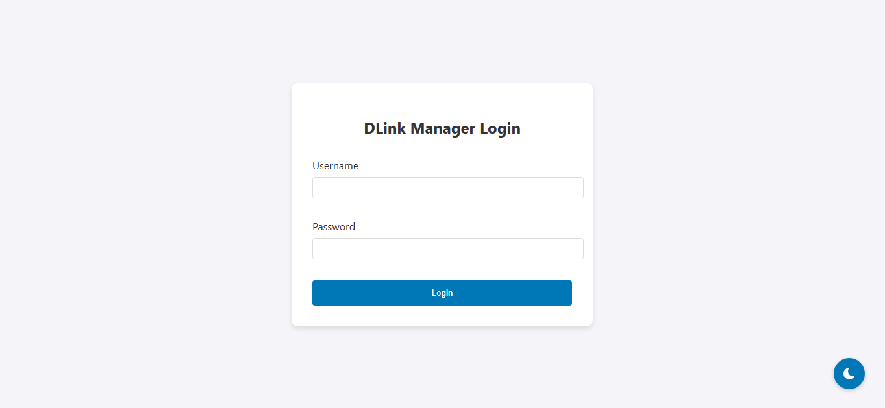
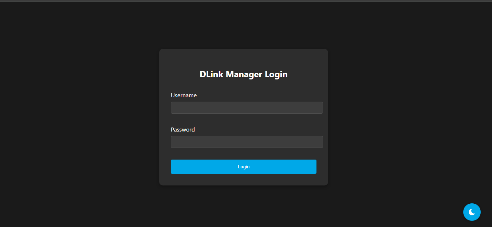

<div align="center">
  
  <h1>DLink Manager</h1>
  <p>A sleek and modern web interface to manage your DLink devices on your network</p>
</div>

## 🚀 Features

- 🔍 Fast network scanning for DLink devices
- 🌙 Dark/Light theme support
- 🔒 Secure login system
- 📱 Responsive design
- ⚡ Real-time device status

## 📸 Screenshots

<div align="center">
  
  
</div>

## 🛠️ Setup

1. Clone the repository
```bash
git clone https://github.com/vnrcorner/dlink.git
cd dlink
```

2. Configure environment variables
```bash
cp .env.example .env
```

3. Run with PHP server
```bash
php -S localhost:8000 -t public
```

## 💻 Tech Stack

- PHP 7.4+
- JavaScript (ES6+)
- CSS3 with Custom Properties
- Socket Programming

## 📋 Requirements

- PHP 7.4 or higher
- PHP Sockets Extension
- Modern web browser

## 🤝 Contributing

1. Fork the project
2. Create your feature branch (`git checkout -b feature/AmazingFeature`)
3. Commit changes (`git commit -m 'Add AmazingFeature'`)
4. Push to branch (`git push origin feature/AmazingFeature`)
5. Open a Pull Request

## 📜 License

This project is licensed under the MIT License - see the [LICENSE](LICENSE) file for details.

## 🙏 Acknowledgments

- [Hostscan](https://github.com/Smaash/hostscan) for network scanning
- Icons from [Feather Icons](https://feathericons.com)

---

<div align="center">
  Made with ❤️ by <a href="https://github.com/vnrcorner">vnrcorner</a>
</div>
